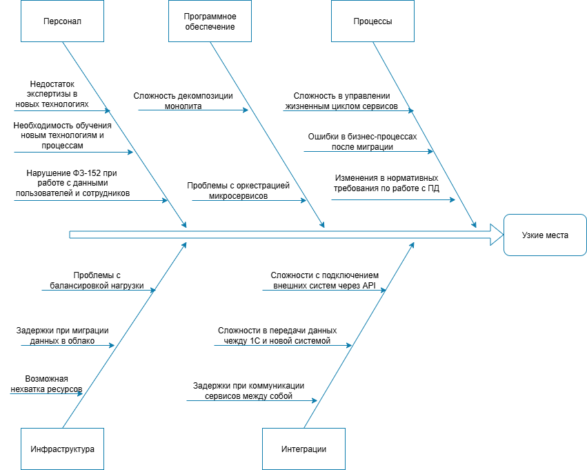

# Оценка узких мест при миграции

### Процессы и компоненты, затрагиваемые миграцией

| Компонент / Процесс                 | Цель миграции                                                                         |
|-------------------------------------|---------------------------------------------------------------------------------------|
| **Хранилище данных**                | Миграция с Excel/файлов 1С на СУБД (Postgres, Hadoop), отвечающая требованиям PCI DSS |
| **Бизнес-логика**                   | Разделение монолита на микросервисы + добавление новых                                |
| **Интеграции с внешними системами** | Внедрение интеграции через публичное API + API-Gateway                                |
| **Прием интернет платежей**         | Внедрение платежного шлюза                                                            |
| **Инфраструктура**                  | Переход с физического сервера на кластер K8s, отвечающий требованиям PCI DSS          |
| **Аутентификация/Авторизация**      | Переход к централизованному IAM + RBAC                                                |
| **Команда и навыки**                | Найм новых сотрудников ИТ отдела с соответствующими компетенциями                     |

### Диаграмма Исикавы

### Меры по устранению узких мест

| Мера                                                                                                        | Приоритет |
|-------------------------------------------------------------------------------------------------------------|-----------|
| Регулярный аудит на соответствие процессов и облачной инфраструктуры выполнению требований ФЗ-152 и PCI DSS | Высокий   |
| Развитие SIEM систем                                                                                        | Высокий   |
| Внедрение современных DevOps практик                                                                        | Высокий   |
| Повышение 'observability' системы (метрик, логи, алерты)                                                    | Высокий   |
| Регулярное ревью и актуализации бизнес аналитики                                                            | Средний   |
| Регулярные технические тренинги и семинары для сотрудников ИТ отдела                                        | Средний   |
| Регулярные тренинги по основам информационной безопасности для всех сотрудников компании                    | Средний   |
